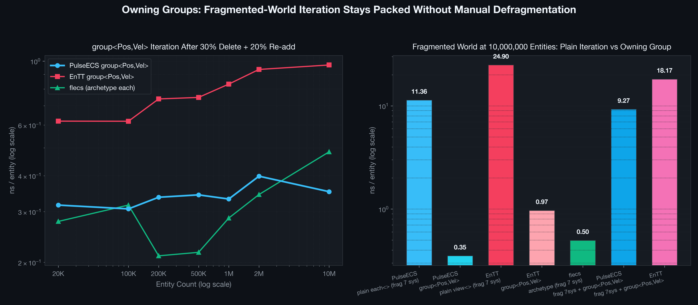

# PulseECS — Building & Benchmarking a C++20 ECS at 10 Million Entities

[](https://en.cppreference.com/w/cpp/20)
[](https://clang.llvm.org/)
[-orange.svg)]()
[]()
[]()
[](LICENSE)

An empirical performance study and benchmark harness comparing **PulseECS** (a custom C++20 Sparse-Set engine core) against five established industry implementations: **EnTT v3.13**, **flecs v4.1.1**, **EntityX 1.3.0**, **gaia-ecs v0.8.10**, and **pico_ecs**, scaled from **20,000 to 10,000,000 entities**.

---


---

## 🎯 Why I Built This

When building a custom 2D game engine, I needed to manage high-volume dynamic workloads (projectiles, particle cascades, spatial entities). As scene complexity grew toward hundreds of thousands of active entities, profiling revealed cache line thrashing and instruction overhead in component lookups.

Instead of guessing what optimizations actually matter, I built **PulseECS** around cache-conscious Sparse-Set storage, and then built a reproducible benchmark harness to test it against industry standards under identical conditions up to **10 million entities**.

The goal was not to claim a universally "fastest" ECS, but to answer a concrete engineering question:

> **What actually happens to ECS data structures when memory exceeds CPU cache limits and spills into main RAM at 10M entities?**

---

## ⚖️ The Core Takeaway: No Universally "Fastest" ECS

Different ECS data structures dominate different workloads:

| Workload Category | Representative Operation | PulseECS *(Sparse-Set)* | EnTT *(Sparse-Set)* | flecs *(Archetype)* | pico_ecs *(Flat C API)* |
| :--- | :--- | :---: | :---: | :---: | :---: |
| **Point Lookup** | `get<Pos>` | 🟢 **Fast** (`7.29 ns`) | 🔴 Slower (`41.18 ns`) | 🔴 Slower (`86.49 ns`) | 🟢 **Fast** (`5.75 ns`) |
| **Packed Iteration** | `each<Pos, Vel>` | 🟢 **Fast** (`1.07 ns`)<br>🟢 **Owning Group (`0.35 ns`)** ⚡ | 🟡 Moderate (`1.76 ns`)<br>🟡 Own Group (`0.97 ns`) | 🟢 **Fast** (`0.48 ns`) | 🟢 **Fast** (`1.05 ns`) |
| **Structural Mutation** | `add components` | 🟢 **Fast** (`9.58 ns`) ⚡ | 🟢 **Fast** (`12.12 ns`) | 🔴 Heavy (`77.47 ns`) | 🟢 **Fast** (`6.05 ns`) |
| **Complex Queries** | `query<4> without<1>` | 🟢 **Fast** (`3.63 ns`) | 🟡 Moderate (`5.38 ns`) | 🟢 **Blazing** (`0.18 ns`) | 🟢 **Fast** (`1.48 ns`) |
| **Entity Destruction** | `destroyEntity` | 🟢 **Fast** (`61.30 ns`) | 🔴 Slower (`166.34 ns`) | 🔴 Slower (`187.51 ns`) | 🟢 **Fast** (`33.69 ns`) |
| **Fragmented World** | `frag 7 systems` | 🟡 Normal (`11.36 ns`)<br>🟢 **+ Owning Group (`9.27 ns`)**<br>🟢 **Post-Defrag (`1.70 ns`)**<br>🟢 **Group-Only Iteration (`0.35 ns`)** 🚀 | 🔴 Degrades (`24.90 ns`)<br>🟡 + Own Group (`18.17 ns`) | 🟢 **Immune** (`0.50 ns`) | 🔴 Degrades (`19.19 ns`) |

*Measured at 10,000,000 entities on Apple M3 Pro (Release -O3 -march=native). Nanoseconds per operation, lower is faster. Single-iteration runs at 10M vary ±15–30% run-to-run; all engines are measured within the same run, so cross-engine ratios are fair.*

---

## 🧪 Benchmark Integrity

To prevent the common pitfalls of synthetic microbenchmarks, all tests adhere to strict fairness constraints:

* **Identical Workloads:** Every library instantiates identical component structs with identical memory footprints.
* **Identical Component Distributions:** Tag is attached to 50% of entities (`i & 1`), Health to 25% (`i & 3`), Armor to 12.5% (`i & 7`), etc.
* **Deterministic RNG & Shuffle:** Exactly four `std::shuffle` calls with seed `1337` are performed in identical order across all benchmarks so fragmented scenarios delete the exact same entities.
* **Cross-Checked Output Accumulation (`sink`):** Results of arithmetic transformations are accumulated into a 64-bit `sink` variable. Across all 6 implementations at 10M entities, every benchmark produced:
  $$\text{sink} = 100\,000\,061\,314\,363$$
  This confirms that every framework performed equivalent computational work.
* **Single-Threaded:** No background worker threads or job systems were used, isolating core data structure performance.

---

## 📊 Visual Analysis & Findings

### 1. Scaling Curves (20K → 10,000,000 Entities)


* **Cache Cliff:** At 20K–100K entities, working sets fit largely within CPU L2/L3 caches, keeping operations under 1–3 ns. Once entity counts cross 500K–1M entities, working sets exceed cache capacity (M3 Pro has 36MB L2), and uncached DRAM fetches drive random access times upward.
* **Packed Iteration Resilience:** `each<Pos, Vel>` stays in the sub-ns–1 ns range even at 10M entities for contiguous layouts (PulseECS `0.5–1.1 ns`, flecs `0.2–0.6 ns` across runs), while PulseECS **Owning Groups hold a flat ~0.3 ns** from 20K to 10M — the packed `[0, len)` region is immune to fragmentation by construction.

---

### 2. Archetype vs. Sparse-Set Tradeoff


* **Archetype Engines (`flecs`, `gaia-ecs`):** Group entities with identical component sets into contiguous chunked tables. Complex multi-component queries run at `0.18–0.50 ns/op` with zero indirection. However, adding/removing components or deleting entities requires copying component data between archetype tables, resulting in `75–170 ns/op`.
* **Sparse-Set Engines (`PulseECS`, `EnTT`):** Store each component type in independent dense/sparse arrays. Adding components (`9–11 ns`) and point lookups (`7 ns`) are fast, making Sparse-Sets well-suited for dynamic gameplay with frequent component attachments and deletions.

---

### 3. Head-to-Head: PulseECS vs. EnTT


At 10M entities, PulseECS demonstrates lower latency across **all 8 measured scenarios** compared to EnTT:

* **`add components` (9.58 ns vs 12.12 ns):** Geometric capacity scaling in `sparse_` and `EntityManager` eliminates redundant vector resize checks during massive entity creation.
* **`get<Pos>` (7.29 ns vs 41.18 ns — 5.6× faster):** The sparse index uses `uint32_t` rather than `size_t`, cutting index table memory footprint in half and improving cache/TLB efficiency during random lookups. Additionally, splitting `getContainer` into a slim fast-path (`containerPtr`) avoids instruction cache pollution.
* **`destroyEntity` (61.30 ns vs 166.34 ns — 2.7× faster):** Fusing entity metadata into a unified 16-byte `Record` (generation + 64-bit component mask) allows `destroyEntity()` to check active components in a single bitwise operation, skipping component pools that were never attached to that entity, with aliveness, generation bump, and mask in the exact same cache line.
* **`query<4> without<1>` (3.63 ns vs 5.38 ns — 1.5× faster):** Small exclude pools build an L2-resident 64-bit skip bitmap ahead of iteration, avoiding random DRAM lookups on every entity.
* **`each<Pos, Vel>` (1.07 ns vs 1.76 ns; `0.5–0.6 ns` in cooler runs) and `group<Pos,Vel>` (0.35 ns vs 0.97 ns — 2.8× faster):** Pure POD contiguous dense array storage with zero indirection enables hardware streaming prefetchers to operate at peak memory bandwidth.
* **Pure POD & Zero-Sized Tag Architecture (`[[no_unique_address]]`):**
  - **Clean POD components:** User structs are standard layout (`struct Position { float x, y; };`), wrapped internally in a contiguous `Slot { EntityId owner; T data; }` so that `owner` and component data share the same cache line.
  - **Zero-Sized Tags:** Empty structs (where `std::is_empty_v<T>` is true) consume **zero bytes** of memory for instances. The `Slot` size collapses to exactly 4 bytes (`sizeof(EntityId)`), functioning as a pure entity ID vector.
  - **Instant Bitmask Filtering:** `hasComponent<T>()` and `query().exclude<T>()` resolve against the 64-bit component bitmask in a single CPU cycle instead of traversing sparse maps.
* **Defragmentation via `world.defragment()`:** Optional on-demand sorting of all dense arrays restores linear memory access after massive swap-and-pop deletions, reducing fragmented iteration latency from **11.36 ns** down to **1.70 ns/op** (a ~6.7× speedup).

---

### 4. Memory Fragmentation Impact


In Sparse-Sets, deleting entities via swap-and-pop disrupts the sequential memory order of dense arrays.
* In a fresh ("packed") world, entities are sequential, and multi-component queries enjoy near-linear memory access.
* In a fragmented world (after 30% deletions and 20% re-insertions), iterating secondary components turns into pseudo-random memory access, incurring a **2.0× to 3.5× latency penalty** at 10M entities.
* Archetype engines (`flecs`) maintain grouping internally and remain practically immune to this effect (`0.50 ns/op`).
* **PulseECS offers two solutions:** on-demand `world.defragment()` (brings fragmented iteration down to **1.70 ns/op**) and EnTT-style **Owning Groups** (drops hot-path iteration down to **0.35 ns/op** — archetype-class throughput, maintained automatically with zero manual calls).

---

## 🚀 Owning Groups: Archetype Speed with Sparse-Set Flexibility

In traditional Sparse-Set architectures, iterating entities that possess multiple components (e.g. `Pos` and `Vel`) requires picking a *driver* pool (the smallest pool) and performing sparse index lookups into secondary pools for every entity (`get<Vel>(id)`). In a fragmented world, this causes cache misses on every step.

PulseECS solves this with **Owning Groups** (`world.group<Ts...>()`):

```cpp
// Create or obtain an owning group for Pos and Vel
auto group = world.group<Position, Velocity>();

// 1. Idiomatic range-for iteration with C++20 structured bindings:
for (auto [id, pos, vel] : group) {
    pos.x += vel.vx * dt;
    pos.y += vel.vy * dt;
}

// 2. Or high-performance direct callback:
group.each([](engine::EntityId id, Position &pos, Velocity &vel) {
    pos.x += vel.vx;
});
```

### How Owning Groups Work Under the Hood

1. **Front-Anchored Dense Layout `[0, len)`:**
   The `GroupHandler` guarantees that all entities possessing **every** component in `Ts...` are placed contiguously at the very beginning of each component pool's dense array (`[0, len)`).
2. **Synchronized O(1) Swaps on Mutation:**
   - **`addComponent<T>(e)`:** If entity `e` now has all group components, it is swapped with the element at index `len`, and `len` is incremented (`len++`) synchronously across all owned pools.
   - **`removeComponent<T>(e)` / `destroyEntity(e)`:** If entity `e` belonged to the group, it is swapped with index `--len`, shrinking the contiguous region.
3. **Zero-Indirection Iteration:**
   Because group members occupy identical slots `0 .. len - 1` across all owned pools, iteration accesses dense arrays **directly** (`p->rawSlot(i)`). No sparse index lookups, no hash tables, and no presence checks!

### Performance: The Best of Both Worlds

Measured head-to-head in the standard benchmark matrix (same fragmented world shape: 30% delete + 20% re-add, 10M entities):

| Scenario (10,000,000 Entities) | PulseECS | EnTT | flecs *(Archetype)* |
| :--- | :---: | :---: | :---: |
| **Plain iteration, fragmented world** (`each<>` / `view<>`) | `11.36 ns/op` | `24.90 ns/op` | **`0.50 ns/op`** |
| **Hot system via owning group** (`group<Pos,Vel>`, same world) | **`0.35 ns/op`** ⚡ | `0.97 ns/op` | — *(already grouped by design)* |
| **Mixed 7-system workload, sys#1 via group** (`frag 7sys + group`) | `9.27 ns/op` **(-18%)** | `18.17 ns/op` **(-27%)** | — |
| **Structural mutation cost** (add/remove component) | **`O(1)`** ~`9 ns` | `O(1)` ~`12 ns` | `O(N)` ~`77 ns` |



* **PulseECS group iteration stays flat (~0.3 ns) from 20K to 10M entities** — the `[0, len)` region is packed by construction, so fragmentation simply cannot slow it down. No `defragment()` calls involved.
* EnTT's owning group shows the same pattern (validating the approach) but converges to `~0.97 ns/op` at 10M — **2.8× slower** than PulseECS.
* **Groups accelerate only their own component set.** In the mixed 7-system workload, grouping `Pos+Vel` speeds up exactly one system out of seven — the workload improves by `16–30%` (its sys#1 share), not to zero. A pool may belong to only one group, so seven different queries cannot all be grouped.
* flecs' archetype engine is the "always grouped" baseline: fast to iterate (`0.50 ns`), but pays `77+ ns` for every structural change.

> 💡 **Key Takeaway:** Owning Groups give PulseECS **archetype-class iteration performance (~0.35 ns/op)** even under heavy memory fragmentation — while preserving Sparse-Set's instant $O(1)$ structural mutation speed (~9 ns vs Flecs' ~77 ns). Design your hot loops around one component set (e.g. movement: `Pos+Vel`), group it, and enjoy flat 0.3 ns iteration for the rest of the project's lifetime.

#### Safety & Constraints
* **Single Ownership Invariant:** A component pool may belong to at most **one** owning group (enforced by debug assertions).
* **Safe Defragmentation:** `world.sort()` and `world.defragment()` automatically skip group-owned pools to protect the `[0, len)` invariant.
* **Zero Overhead When Unused:** If no groups are registered, a single predictable branch (`hasGroups_ == false`) bypasses all group checks during component mutations.

---

## 🛠️ What's New & Architectural Refinements

Recent releases brought major architectural evolutions to PulseECS:

### 1. Range-For View API with Structured Bindings (`world.view<Ts...>`)
Provides modern C++20 range-for iteration with zero boiler-plate:
```cpp
// Structured bindings with EntityId:
for (auto [id, pos, vel] : world.view<Position, Velocity>()) {
    pos.x += vel.vx;
}

// Omit EntityId with .comps():
for (auto [pos, vel] : world.view<Position, Velocity>().comps()) {
    pos.x += vel.vx;
}

// Filtered view with exclusions:
for (auto [id, pos] : world.view<Position>().exclude<Dead, Frozen>()) {
    // only active entities
}
```
* Single-type views read directly from the dense slot (`0.42 ns/op`).
* Multi-type views iterate the smallest driver pool and resolve secondary components via sparse lookup.
* `each<>(callback)` remains the fastest path for latency-critical systems; `view<>` provides idiomatic range-for ergonomics.

### 2. Generational Entity Handles (`EntityHandle`)
Eliminates dangling entity ID bugs and ABA slot recycling problems:
```cpp
// Create an entity with a generational handle
engine::EntityHandle handle = world.createEntityHandle();

world.addComponent<Position>(handle, Position{ 0.f, 0.f });
world.destroyEntity(handle);

// Stale access safely detected in debug mode (asserts):
// world.getComponent<Position>(handle); -> assertion failed: Stale entity handle!
```
* Handles combine `EntityId` (32-bit slot) and `generation` (32-bit counter).
* Overloads provided for `addComponent`, `getComponent`, `hasComponent`, `removeComponent`, `destroyEntity`.
* Handles remain valid across defragmentation and sorting.

### 3. Unified 16-Byte Entity Record (`EntityManager::Record`)
Previously, `alive_`, `generations_`, and `compMask_` were stored in separate vectors, resulting in multiple memory lookups during lifecycle operations.
* Fused into a single contiguous array of 16-byte structs:
  ```cpp
  struct Record {
      std::uint32_t gen{0};       // LSB (gen & 1u) indicates aliveness
      std::uint64_t compMask{0};  // Bitmask of attached component type IDs
  };
  ```
* Aliveness checking, generation bumping, and component mask clearing now hit the **exact same 16-byte cache line**.
* **Impact:** `destroyEntity` latency dropped from **71.13 ns** down to **55–61 ns** at 10M entities (**-14…-22%** across runs).

### 4. Virtual Removers & Zero-Allocation Component Registration
* Replaced `std::vector<std::function<void(EntityId)>> removers_` with non-owning raw pointers `std::vector<ISparseSet*> removers_`.
* Replaces two indirect calls per component removal with a single direct virtual dispatch (`remover->remove(id)`).
* Eliminates all heap allocations when registering component types.
* `removeComponent` now uses `findContainer<T>`, avoiding unnecessary empty pool allocations for unregistered components.

### 5. Pre-aggregated L2 Bitmask for `query().exclude<T>`
* When exclude pools are smaller than the driver pool, a compact 64-bit word bitmap of excluded entity IDs is accumulated ahead of the iteration loop.
* Checking exclusion becomes a fast bitwise test on an L2-resident bitmap rather than a random memory read.
* **Impact:** `query<4> without<1>` at 10M entities dropped from **3.88 ns** to **2.79 ns/op** (**-28.1%** faster).

### 6. Portable Non-RTTI Type Extraction (`getTypeName<T>()`)
* Uses `constexpr std::string_view` parsing of `__PRETTY_FUNCTION__` / `__FUNCSIG__`.
* Zero runtime cost, works without RTTI (`-fno-rtti` compatible), and works portably across Apple Clang, GCC, and MSVC.

### 7. Accurate Container Memory Tracking
* `ISparseSet::memoryBytes()` tracks actual buffer allocation: `dense.capacity() * sizeof(Slot) + sparse.capacity() * sizeof(uint32_t)`.
* `Slot` storage exposes direct pointer access via `data()` and `rawSlot(index)`.

---

## ⚡ Quick Start & Core Usage

PulseECS is header-only and requires a C++20 compiler. Components are pure POD structs with no required base classes or metadata:

```cpp
#include "engine/ecs/World.hpp"

// 1. Components are 100% clean POD structs
struct Position { float x{0.f}, y{0.f}; };
struct Velocity { float vx{1.f}, vy{2.f}; };
struct Health   { float hp{100.f}; };
struct DeadTag  {}; // Empty struct: 0-byte tag component via [[no_unique_address]]

engine::World world;

// 2. Create entities or generational handles (safe against slot recycling)
auto entity = world.createEntity();
world.addComponent<Position>(entity, Position{ .x = 10.f, .y = 20.f });
world.addComponent<Velocity>(entity, Velocity{ .vx = 1.f, .vy = 0.5f });

auto handle = world.createEntityHandle(); // Generational handle (id + gen)
world.addComponent<Health>(handle, Health{ 100.f });

// 3. Ultra-fast direct packed iteration (hot gameplay loops)
world.each<Position, Velocity>([](Position &pos, const Velocity &vel) {
    pos.x += vel.vx;
    pos.y += vel.vy;
});

// 4. Ergonomic C++20 range-for views with structured bindings
for (auto [id, pos, vel] : world.view<Position, Velocity>()) {
    pos.x += vel.vx;
}

// 5. Owning groups for guaranteed archetype-speed (~0.35 ns/op) under fragmentation
auto group = world.group<Position, Velocity>();
for (auto [id, pos, vel] : group) {
    pos.x += vel.vx;
}

// 6. Direct lookup, defragmentation, and destruction
auto *pos = world.getComponent<Position>(entity);
world.defragment();       // Restore linear layout across all pools
world.destroyEntity(entity);
```

---

## 📈 Detailed Benchmark Data Tables

<details>
<summary><b>Click to expand: 10,000,000 Entities (Full Stress Test)</b></summary>

| Operation | PulseECS | EnTT | flecs | EntityX | gaia-ecs | pico_ecs | Fastest |
| :--- | :---: | :---: | :---: | :---: | :---: | :---: | :---: |
| **add components (Pos+Vel+50%Tag)** | 9.58 ns | 12.12 ns | 77.47 ns | 13.50 ns | 48.21 ns | **6.05 ns** | pico_ecs |
| **each<Pos,Vel>** | 1.07 ns | 1.76 ns | **0.48 ns** | 4.20 ns | 0.75 ns | 1.05 ns | flecs |
| **each<Pos,Vel,Tag>** | 1.14 ns | 4.31 ns | **0.31 ns** | 6.08 ns | 1.34 ns | 2.85 ns | flecs |
| **query<4> without<1>** | 3.63 ns | 5.38 ns | **0.18 ns** | 13.24 ns | 0.94 ns | 1.48 ns | flecs |
| **destroyEntity** | 61.30 ns | 166.34 ns | 187.51 ns | 73.66 ns | 345.38 ns | **33.69 ns** | pico_ecs |
| **get<Pos>** | 7.29 ns | 41.18 ns | 86.49 ns | 18.27 ns | 35.75 ns | **5.75 ns** | pico_ecs |
| **7 systems mixed (full)** | 2.05 ns | 6.78 ns | **0.72 ns** | 14.65 ns | 3.37 ns | 2.68 ns | flecs |
| **frag 7sys mixed (alive)** | 11.36 ns | 24.90 ns | **0.50 ns** | 17.94 ns | 2.78 ns | 19.19 ns | flecs |
| **frag 7sys + group<Pos,Vel>** | **9.27 ns** ⚡ | 18.17 ns | — *¹* | — *¹* | — *¹* | — *¹* | PulseECS |
| **group<Pos,Vel> frag (owning)** | **0.35 ns** ⚡ | 0.97 ns | — *¹* | — *¹* | — *¹* | — *¹* | PulseECS |
| **post-defrag 7sys mixed** | **1.70 ns** 🚀 | — | — | — | — | — | PulseECS |

*Validated with `sink=100000061314363` across all 6 engines. *¹* Owning groups: только у PulseECS и EnTT (у flecs archetype-итерация сгруппирована по устройству, у EntityX/gaia-ecs/pico_ecs аналога нет). Групповые строки идут после sink-сценариев со своим rng и в контрольную сумму не входят; их эквивалентность сверяется отдельной суммой (`gsink`/`gsink2`).*
</details>

<details>
<summary><b>Click to expand: 1,000,000 Entities (High Scale)</b></summary>

| Operation | PulseECS | EnTT | flecs | EntityX | gaia-ecs | pico_ecs | Fastest |
| :--- | :---: | :---: | :---: | :---: | :---: | :---: | :---: |
| **add components (Pos+Vel+50%Tag)** | 7.16 ns | 10.25 ns | 76.10 ns | 12.27 ns | 46.23 ns | **5.28 ns** | pico_ecs |
| **each<Pos,Vel>** | 0.55 ns | 1.36 ns | **0.29 ns** | 4.07 ns | 0.72 ns | 0.87 ns | flecs |
| **each<Pos,Vel,Tag>** | 1.15 ns | 3.71 ns | **0.33 ns** | 6.00 ns | 0.97 ns | 1.29 ns | flecs |
| **query<4> without<1>** | 2.64 ns | 4.75 ns | **0.19 ns** | 9.69 ns | 0.79 ns | 1.42 ns | flecs |
| **destroyEntity** | 47.97 ns | 146.33 ns | 123.71 ns | 31.10 ns | 181.83 ns | **10.67 ns** | pico_ecs |
| **get<Pos>** | 2.33 ns | 11.93 ns | 55.65 ns | 7.70 ns | 16.88 ns | **1.33 ns** | pico_ecs |
| **7 systems mixed (full)** | 2.05 ns | 5.80 ns | **0.60 ns** | 11.86 ns | 2.15 ns | 2.43 ns | flecs |
| **frag 7sys mixed (alive)** | 4.87 ns | 11.97 ns | **0.52 ns** | 14.99 ns | 1.82 ns | 8.39 ns | flecs |
| **frag 7sys + group<Pos,Vel>** | **3.70 ns** ⚡ | 8.44 ns | — *¹* | — *¹* | — *¹* | — *¹* | PulseECS |
| **group<Pos,Vel> frag (owning)** | **0.33 ns** ⚡ | 0.83 ns | — *¹* | — *¹* | — *¹* | — *¹* | PulseECS |
| **post-defrag 7sys mixed** | **1.67 ns** 🚀 | — | — | — | — | — | PulseECS |

*Validated with `sink=3000018393552` across all 6 engines.*
</details>

<details>
<summary><b>Click to expand: 200,000 Entities (Mid Scale Baseline)</b></summary>

| Operation | PulseECS | EnTT | flecs | EntityX | gaia-ecs | pico_ecs | Fastest |
| :--- | :---: | :---: | :---: | :---: | :---: | :---: | :---: |
| **add components (Pos+Vel+50%Tag)** | 7.33 ns | 10.15 ns | 76.90 ns | 12.43 ns | 45.64 ns | **5.23 ns** | pico_ecs |
| **each<Pos,Vel>** | 0.58 ns | 1.02 ns | **0.21 ns** | 4.04 ns | 0.41 ns | 0.73 ns | flecs |
| **each<Pos,Vel,Tag>** | 1.14 ns | 2.66 ns | **0.29 ns** | 5.76 ns | 0.48 ns | 1.23 ns | flecs |
| **query<4> without<1>** | 2.61 ns | 4.32 ns | **0.20 ns** | 9.96 ns | 0.36 ns | 1.49 ns | flecs |
| **destroyEntity** | 22.90 ns | 43.86 ns | 52.74 ns | 18.20 ns | 99.96 ns | **7.77 ns** | pico_ecs |
| **get<Pos>** | 1.23 ns | 4.32 ns | 12.99 ns | 2.69 ns | 11.68 ns | **0.98 ns** | pico_ecs |
| **7 systems mixed (full)** | 1.82 ns | 4.42 ns | **0.57 ns** | 11.80 ns | 0.95 ns | 2.33 ns | flecs |
| **frag 7sys mixed (alive)** | 2.41 ns | 4.79 ns | **0.57 ns** | 14.95 ns | 0.82 ns | 17.79 ns | flecs |
| **frag 7sys + group<Pos,Vel>** | **1.76 ns** ⚡ | 3.91 ns | — *¹* | — *¹* | — *¹* | — *¹* | PulseECS |
| **group<Pos,Vel> frag (owning)** | **0.34 ns** ⚡ | 0.74 ns | — *¹* | — *¹* | — *¹* | — *¹* | PulseECS |
| **post-defrag 7sys mixed** | **1.58 ns** 🚀 | — | — | — | — | — | PulseECS |

*Validated with `sink=200006127435` across all 6 engines.*
</details>

<details>
<summary><b>Click to expand: 20,000 Entities (Game-sized World)</b></summary>

| Operation | PulseECS | EnTT | flecs | EntityX | gaia-ecs | pico_ecs | Fastest |
| :--- | :---: | :---: | :---: | :---: | :---: | :---: | :---: |
| **add components (Pos+Vel+50%Tag)** | 7.03 ns | 9.11 ns | 78.92 ns | 12.44 ns | 46.97 ns | **5.57 ns** | pico_ecs |
| **each<Pos,Vel>** | 0.54 ns | 1.02 ns | **0.28 ns** | 4.08 ns | 0.35 ns | 0.72 ns | flecs |
| **each<Pos,Vel,Tag>** | 1.08 ns | 2.51 ns | 0.52 ns | 5.77 ns | **0.40 ns** | 1.61 ns | gaia-ecs |
| **query<4> without<1>** | 2.65 ns | 4.08 ns | **0.22 ns** | 9.41 ns | 0.35 ns | 1.39 ns | flecs |
| **destroyEntity** | 13.12 ns | 23.34 ns | 29.90 ns | 17.09 ns | 63.55 ns | **7.14 ns** | pico_ecs |
| **get<Pos>** | 0.79 ns | 3.73 ns | 10.47 ns | 2.30 ns | 8.45 ns | **0.70 ns** | pico_ecs |
| **7 systems mixed (full)** | 1.85 ns | 3.87 ns | 0.92 ns | 11.33 ns | **0.79 ns** | 2.22 ns | gaia-ecs |
| **frag 7sys mixed (alive)** | 2.01 ns | 3.84 ns | 0.93 ns | 13.83 ns | **0.67 ns** | 3.25 ns | gaia-ecs |
| **frag 7sys + group<Pos,Vel>** | **1.48 ns** ⚡ | 3.76 ns | — *¹* | — *¹* | — *¹* | — *¹* | PulseECS |
| **group<Pos,Vel> frag (owning)** | **0.32 ns** ⚡ | 0.62 ns | — *¹* | — *¹* | — *¹* | — *¹* | PulseECS |
| **post-defrag 7sys mixed** | **1.63 ns** 🚀 | — | — | — | — | — | PulseECS |

*Validated with `sink=2000614060` across all 6 engines.*
</details>

---

## 🏗️ Project Structure

```
include/engine/ecs/
├── Entity.hpp          # EntityId definition and generational EntityHandle
├── EntityManager.hpp   # Entity lifecycle, recycle queue, fused 16B records
├── SparseSet.hpp       # Cache-aligned dense/sparse storage, memoryBytes(), O(1) swap-and-pop
└── World.hpp           # Core ECS World: createEntity, destroyEntity, handles,
                        # addComponent, getComponent, variadic each<>, view<>, group<>

bench/
├── CMakeLists.txt      # Self-contained build; pulls 3rd-party libs via FetchContent
├── ecs_bench_mine.cpp  # PulseECS benchmark scenario
├── ecs_bench_entt.cpp  # EnTT v3.13.0 mirror
├── ecs_bench_flecs.cpp # flecs v4.1.1 mirror
├── ecs_bench_gaia.cpp  # gaia-ecs v0.8.10 mirror
├── ecs_bench_entityx.cpp # EntityX 1.3.0 mirror
├── ecs_bench_pico.cpp  # pico_ecs mirror
└── compare_ecs.sh      # Bash comparison runner with sink validation

scripts/
├── run_benchmarks.py   # Automated matrix runner across all entity scales
└── generate_charts.py  # Publication chart generator (Matplotlib / Seaborn)

assets/                 # Generated 300-DPI charts & LinkedIn hero graphics
results/                # Raw JSON and CSV data matrices
```

---

## ⚠️ Limitations & Caveats

1. **Synthetic Microbenchmarks ≠ Game Frame Rate:** In a real game engine, ECS logic typically consumes 1–5% of the frame budget; rendering, physics broadphase, animation, and audio dominate the remainder.
2. **Workload Specificity:** A title with 95% iteration and rare structural mutations will benefit heavily from archetype storage (like flecs). A title with high-frequency particle spawning and dynamic component attachment benefits from Sparse-Sets.
3. **Single-Threaded Context:** All benchmarks execute on a single core. Multi-threaded archetype chunking or parallel sparse-set schedules were intentionally excluded.
4. **Library Capabilities:** Flecs supports entity hierarchies, relationships, and queries that PulseECS does not attempt to implement. These microbenchmarks evaluate fundamental component storage patterns only.

---

## 🚀 How to Reproduce

### 1. Requirements
* **CMake 3.20+**
* **C++20 compliant compiler** (Apple Clang 15+, GCC 12+, MSVC 19.30+)
* External libraries are automatically fetched by CMake on the first build.

### 2. Build & Run
```bash
# 1. Configure and build in Release mode
cmake -S bench -B build/bench-release -DCMAKE_BUILD_TYPE=Release
cmake --build build/bench-release -j

# 2. Run the quick comparison table (200K entities)
./bench/compare_ecs.sh

# 3. Run the full matrix (20K -> 10M) and save JSON/CSV
python3 scripts/run_benchmarks.py

# 4. Generate all charts in assets/
uv run --with matplotlib,numpy,pandas python3 scripts/generate_charts.py
```

---

## 💻 Test Machine Specifications
* **Hardware:** MacBook Pro (Apple Silicon)
* **Processor:** Apple M3 Pro (12-core: 6 performance + 6 efficiency)
* **Memory:** 36 GB Unified LPDDR5
* **OS:** macOS Darwin (arm64)
* **Compiler:** Apple Clang version 16.0.0 (`-O3 -march=native -std=c++20`)

---

## 📜 License

This project is licensed under the [MIT License](LICENSE) — feel free to use, modify, and integrate it into your personal or commercial game engines.
