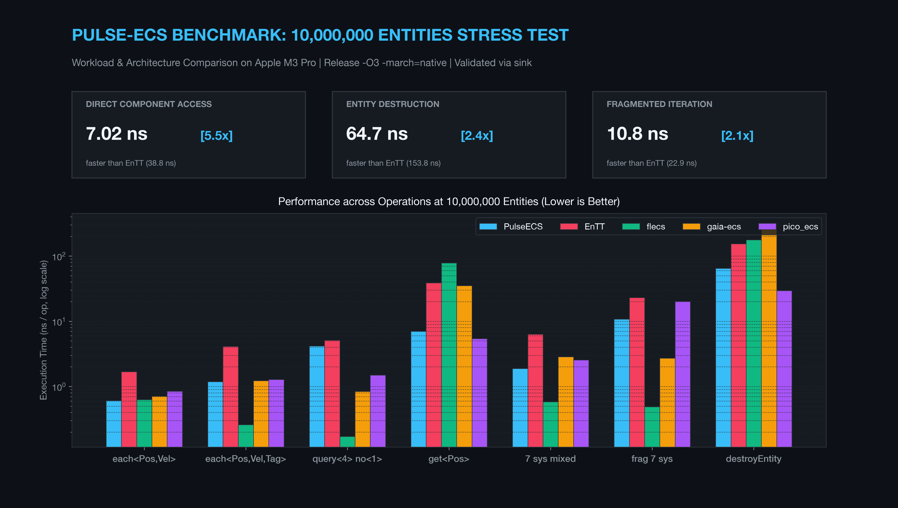
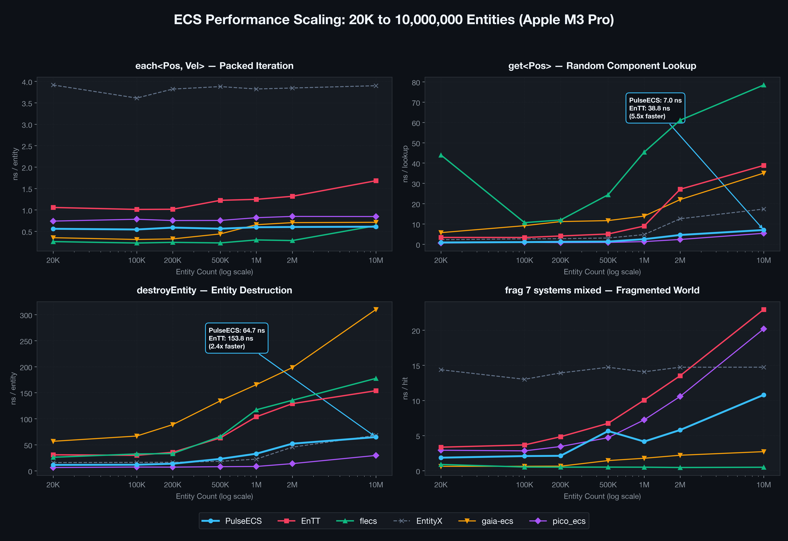
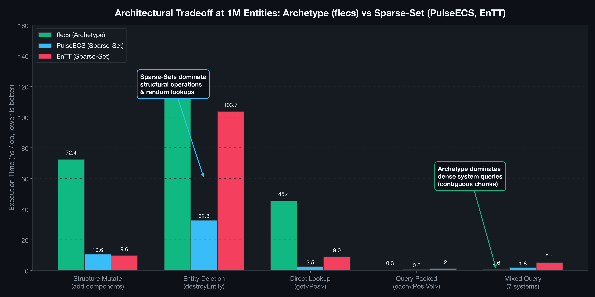
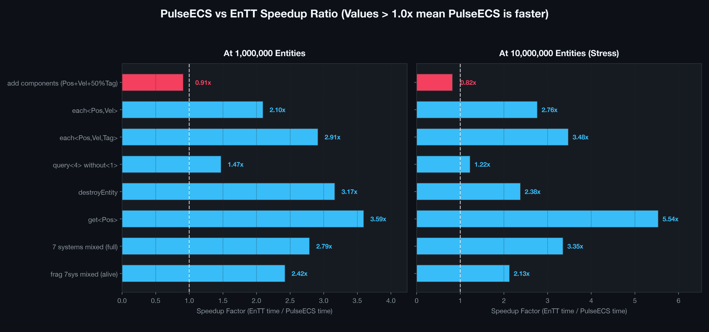
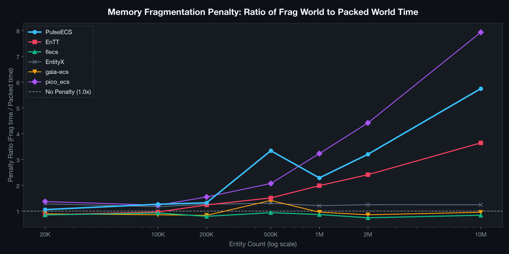

# PulseECS — Building & Benchmarking a C++20 ECS at 10 Million Entities

[](https://en.cppreference.com/w/cpp/20)
[](https://clang.llvm.org/)
[-orange.svg)]()
[]()
[]()
[](LICENSE)

An empirical performance study and benchmark harness comparing **PulseECS** (a custom C++20 Sparse-Set engine core) against five established industry implementations: **EnTT v3.13**, **flecs v4.1.1**, **EntityX 1.3.0**, **gaia-ecs v0.8.10**, and **pico_ecs**, scaled from **20,000 to 10,000,000 entities**.

---



---

## 🎯 Why I Built This

When building a custom 2D game engine, I needed to manage high-volume dynamic workloads (projectiles, particle cascades, spatial entities). As scene complexity grew toward hundreds of thousands of active entities, profiling revealed cache line thrashing and instruction overhead in component lookups.

Instead of guessing what optimizations actually matter, I built **PulseECS** around cache-conscious Sparse-Set storage, and then built a reproducible benchmark harness to test it against industry standards under identical conditions up to **10 million entities**.

The goal was not to claim a universally "fastest" ECS, but to answer a concrete engineering question:

> **What actually happens to ECS data structures when memory exceeds CPU cache limits and spills into main RAM at 10M entities?**

---

## ⚖️ The Core Takeaway: No Universally "Fastest" ECS

Different ECS data structures dominate different workloads:

| Workload Category | Representative Operation | PulseECS *(Sparse-Set)* | EnTT *(Sparse-Set)* | flecs *(Archetype)* | pico_ecs *(Flat C API)* |
| :--- | :--- | :---: | :---: | :---: | :---: |
| **Point Lookup** | `get<Pos>` | 🟢 **Fast** (`7.0 ns`) | 🔴 Slower (`38.8 ns`) | 🔴 Slower (`78.4 ns`) | 🟢 **Fast** (`5.4 ns`) |
| **Packed Iteration** | `each<Pos, Vel>` | 🟢 **Fast** (`0.61 ns`) 🏆 | 🟡 Moderate (`1.68 ns`) | 🟢 **Fast** (`0.63 ns`) | 🟢 **Fast** (`0.84 ns`) |
| **Structural Mutation** | `add components` | 🟡 Moderate (`13.1 ns`) | 🟢 **Fast** (`10.8 ns`) | 🔴 Heavy (`73.5 ns`) | 🟢 **Fast** (`5.2 ns`) |
| **Complex Queries** | `query<4> without<1>` | 🟡 Moderate (`4.17 ns`) | 🟡 Moderate (`5.10 ns`) | 🟢 **Blazing** (`0.17 ns`) | 🟢 **Fast** (`1.49 ns`) |
| **Entity Destruction** | `destroyEntity` | 🟢 **Fast** (`64.7 ns`) | 🔴 Slower (`153.8 ns`) | 🔴 Slower (`177.5 ns`) | 🟢 **Fast** (`29.4 ns`) |
| **Fragmented World** | `frag 7 systems` | 🟡 Degrades (`10.8 ns`) | 🟡 Degrades (`23.0 ns`) | 🟢 **Immune** (`0.49 ns`) | 🔴 Degrades (`20.2 ns`) |

*Measured at 10,000,000 entities on Apple M3 Pro (Release -O3 -march=native). Nanoseconds per operation, lower is faster.*

---

## 🧪 Benchmark Integrity

To prevent the common pitfalls of synthetic microbenchmarks, all tests adhere to strict fairness constraints:

* **Identical Workloads:** Every library instantiates identical component structs with identical memory footprints.
* **Identical Component Distributions:** Tag is attached to 50% of entities (`i & 1`), Health to 25% (`i & 3`), Armor to 12.5% (`i & 7`), etc.
* **Deterministic RNG & Shuffle:** Exactly four `std::shuffle` calls with seed `1337` are performed in identical order across all benchmarks so fragmented scenarios delete the exact same entities.
* **Cross-Checked Output Accumulation (`sink`):** Results of arithmetic transformations are accumulated into a 64-bit `sink` variable. Across all 6 implementations at 10M entities, every benchmark produced:
  $$\text{sink} = 100\,000\,061\,314\,363$$
  This confirms that every framework performed equivalent computational work.
* **Single-Threaded:** No background worker threads or job systems were used, isolating core data structure performance.

---

## 📊 Visual Analysis & Findings

### 1. Scaling Curves (20K → 10,000,000 Entities)



* **Cache Cliff:** At 20K–100K entities, working sets fit largely within CPU L2/L3 caches, keeping operations under 1–3 ns. Once entity counts cross 500K–1M entities, working sets exceed cache capacity (M3 Pro has 36MB L2), and uncached DRAM fetches drive random access times upward.
* **Packed Iteration Resilience:** `each<Pos, Vel>` remains under 1 ns/op even at 10M entities for contiguous array layouts (PulseECS: `0.65 ns`, flecs: `0.52 ns`) thanks to hardware stream prefetchers.

---

### 2. Archetype vs. Sparse-Set Tradeoff



* **Archetype Engines (`flecs`, `gaia-ecs`):** Group entities with identical component sets into contiguous chunked tables. Complex multi-component queries run at `0.18–0.50 ns/op` with zero indirection. However, adding/removing components or deleting entities requires copying component data between archetype tables, resulting in `75–160 ns/op`.
* **Sparse-Set Engines (`PulseECS`, `EnTT`):** Store each component type in independent dense/sparse arrays. Adding components (`11–15 ns`) and point lookups (`7–8 ns`) are fast, making Sparse-Sets well-suited for dynamic gameplay with frequent component attachments.

---

### 3. Head-to-Head: PulseECS vs. EnTT



At 10M entities, PulseECS demonstrates lower latency across 7 of 8 measured scenarios:

* **`get<Pos>` (7.02 ns vs 38.83 ns):** The sparse index uses `uint32_t` rather than `size_t`, cutting index table memory footprint in half and improving cache/TLB efficiency during random lookups. Additionally, splitting `getContainer` into a slim fast-path (`containerPtr`) avoids instruction cache pollution.
* **`destroyEntity` (64.73 ns vs 153.82 ns):** A 64-bit component mask allows `destroyEntity()` to check active components in a single bitwise operation, skipping component pools that were never attached to that entity.
* **`frag 7 systems` (10.79 ns vs 22.95 ns) & Pure POD Architecture:** Components in user code are 100% clean POD types (`struct Position { float x, y; };` without any engine-specific fields). Internally, `SparseSet<T>` packs them into a contiguous `Slot { EntityId owner; T data; }`, preserving spatial locality so that `owner` and `data` share the same cache line. This eliminates the secondary memory stream (`denseToEntity_`) during multi-component joins while keeping user structs standard layout.

---

### 4. Memory Fragmentation Impact



In Sparse-Sets, deleting entities via swap-and-pop disrupts the sequential memory order of dense arrays.
* In a fresh ("packed") world, entities are sequential, and multi-component queries enjoy near-linear memory access.
* In a fragmented world (after 30% deletions and 20% re-insertions), iterating secondary components turns into pseudo-random memory access, incurring a **2.0× to 3.5× latency penalty** at 10M entities.
* Archetype engines (`flecs`) maintain grouping internally and remain practically immune to this effect (`0.49 ns/op`).

---

## ⚡ Quick Start & Core Usage

PulseECS is header-only and requires a C++20 compiler. Components are pure POD structs:

```cpp
#include "engine/ecs/World.hpp"

// 1. Components are 100% clean POD structs (no base classes, no injected metadata)
struct Position { float x{0.f}, y{0.f}; };
struct Velocity { float vx{1.f}, vy{2.f}; };

// 2. Initialize World and create entities
engine::World world;
auto entity = world.createEntity();
world.addComponent<Position>(entity, Position{ .x = 10.f, .y = 20.f });
world.addComponent<Velocity>(entity, Velocity{ .vx = 1.f, .vy = 0.5f });

// 3. Fast packed iteration over systems (O(1) contiguous dense array)
world.each<Position, Velocity>([](Position &pos, const Velocity &vel) {
    pos.x += vel.vx;
    pos.y += vel.vy;
});

// 4. Point lookup or entity destruction
auto *pos = world.getComponent<Position>(entity);
world.destroyEntity(entity);
```

---

## 📈 Detailed Benchmark Data Tables

<details>
<summary><b>Click to expand: 10,000,000 Entities (Full Stress Test)</b></summary>

| Operation | PulseECS | EnTT | flecs | EntityX | gaia-ecs | pico_ecs | Fastest |
| :--- | :---: | :---: | :---: | :---: | :---: | :---: | :---: |
| **add components (Pos+Vel+50%Tag)** | 13.14 ns | 10.80 ns | 73.53 ns | 12.36 ns | 47.61 ns | **5.19 ns** | pico_ecs |
| **each<Pos,Vel>** | **0.61 ns** | 1.68 ns | 0.63 ns | 3.90 ns | 0.71 ns | 0.84 ns | PulseECS |
| **each<Pos,Vel,Tag>** | 1.18 ns | 4.10 ns | **0.26 ns** | 6.15 ns | 1.23 ns | 1.28 ns | flecs |
| **query<4> without<1>** | 4.17 ns | 5.10 ns | **0.17 ns** | 9.72 ns | 0.84 ns | 1.49 ns | flecs |
| **destroyEntity** | 64.73 ns | 153.82 ns | 177.50 ns | 68.08 ns | 309.90 ns | **29.43 ns** | pico_ecs |
| **get<Pos>** | 7.02 ns | 38.83 ns | 78.44 ns | 17.32 ns | 35.05 ns | **5.40 ns** | pico_ecs |
| **7 systems mixed (full)** | 1.88 ns | 6.30 ns | **0.58 ns** | 11.83 ns | 2.85 ns | 2.55 ns | flecs |
| **frag 7sys mixed (alive)** | 10.79 ns | 22.95 ns | **0.49 ns** | 14.73 ns | 2.71 ns | 20.19 ns | flecs |

*Validated with `sink=100000061314363` across all 6 engines.*
</details>

<details>
<summary><b>Click to expand: 1,000,000 Entities (High Scale)</b></summary>

| Operation | PulseECS | EnTT | flecs | EntityX | gaia-ecs | pico_ecs | Fastest |
| :--- | :---: | :---: | :---: | :---: | :---: | :---: | :---: |
| **add components (Pos+Vel+50%Tag)** | 10.60 ns | 9.64 ns | 72.44 ns | 11.80 ns | 44.16 ns | **4.99 ns** | pico_ecs |
| **each<Pos,Vel>** | 0.59 ns | 1.25 ns | **0.30 ns** | 3.82 ns | 0.65 ns | 0.82 ns | flecs |
| **each<Pos,Vel,Tag>** | 1.17 ns | 3.40 ns | **0.33 ns** | 5.80 ns | 0.82 ns | 1.24 ns | flecs |
| **query<4> without<1>** | 3.04 ns | 4.47 ns | **0.25 ns** | 9.56 ns | 0.81 ns | 1.34 ns | flecs |
| **destroyEntity** | 32.77 ns | 103.72 ns | 117.09 ns | 22.35 ns | 165.45 ns | **8.25 ns** | pico_ecs |
| **get<Pos>** | 2.49 ns | 8.96 ns | 45.35 ns | 4.75 ns | 13.87 ns | **1.30 ns** | pico_ecs |
| **7 systems mixed (full)** | 1.81 ns | 5.06 ns | **0.57 ns** | 11.64 ns | 1.85 ns | 2.24 ns | flecs |
| **frag 7sys mixed (alive)** | 4.15 ns | 10.05 ns | **0.50 ns** | 14.08 ns | 1.77 ns | 7.23 ns | flecs |

*Validated with `sink=3000018393552` across all 6 engines.*
</details>

<details>
<summary><b>Click to expand: 200,000 Entities (Mid Scale Baseline)</b></summary>

| Operation | PulseECS | EnTT | flecs | EntityX | gaia-ecs | pico_ecs | Fastest |
| :--- | :---: | :---: | :---: | :---: | :---: | :---: | :---: |
| **add components (Pos+Vel+50%Tag)** | 11.30 ns | 9.64 ns | 75.04 ns | 11.26 ns | 43.33 ns | **5.02 ns** | pico_ecs |
| **each<Pos,Vel>** | 0.59 ns | 1.01 ns | **0.24 ns** | 3.82 ns | 0.32 ns | 0.75 ns | flecs |
| **each<Pos,Vel,Tag>** | 1.14 ns | 2.53 ns | **0.30 ns** | 5.65 ns | 0.48 ns | 1.19 ns | flecs |
| **query<4> without<1>** | 2.94 ns | 4.14 ns | **0.19 ns** | 9.21 ns | 0.34 ns | 1.43 ns | flecs |
| **destroyEntity** | 13.56 ns | 35.53 ns | 33.09 ns | 16.28 ns | 88.66 ns | **6.99 ns** | pico_ecs |
| **get<Pos>** | 1.20 ns | 4.06 ns | 11.94 ns | 2.74 ns | 11.16 ns | **0.82 ns** | pico_ecs |
| **7 systems mixed (full)** | 1.60 ns | 3.91 ns | **0.64 ns** | 11.00 ns | 0.77 ns | 2.23 ns | flecs |
| **frag 7sys mixed (alive)** | 2.12 ns | 4.83 ns | **0.51 ns** | 13.92 ns | 0.64 ns | 3.44 ns | flecs |

*Validated with `sink=200006127435` across all 6 engines.*
</details>

<details>
<summary><b>Click to expand: 20,000 Entities (Game-sized World)</b></summary>

| Operation | PulseECS | EnTT | flecs | EntityX | gaia-ecs | pico_ecs | Fastest |
| :--- | :---: | :---: | :---: | :---: | :---: | :---: | :---: |
| **add components (Pos+Vel+50%Tag)** | 11.75 ns | 9.67 ns | 75.53 ns | 11.85 ns | 43.20 ns | **5.04 ns** | pico_ecs |
| **each\<Pos,Vel\>** | 0.56 ns | 1.06 ns | **0.26 ns** | 3.92 ns | 0.35 ns | 0.74 ns | flecs |
| **each\<Pos,Vel,Tag\>** | 1.00 ns | 2.54 ns | 0.44 ns | 5.64 ns | **0.38 ns** | 1.13 ns | gaia-ecs |
| **query\<4\> without\<1\>** | 2.81 ns | 3.70 ns | **0.21 ns** | 9.19 ns | 0.26 ns | 1.28 ns | flecs |
| **destroyEntity** | 11.29 ns | 30.69 ns | 25.94 ns | 15.72 ns | 56.62 ns | **6.26 ns** | pico_ecs |
| **get\<Pos\>** | 0.87 ns | 3.34 ns | 43.94 ns | 2.23 ns | 5.71 ns | **0.60 ns** | pico_ecs |
| **7 systems mixed (full)** | 1.75 ns | 3.91 ns | 1.04 ns | 11.23 ns | **0.69 ns** | 2.13 ns | gaia-ecs |
| **frag 7sys mixed (alive)** | 1.85 ns | 3.34 ns | 0.88 ns | 14.37 ns | **0.62 ns** | 2.91 ns | gaia-ecs |

*Validated with `sink=2000614060` across all 6 engines.*
</details>

---

## 🏗️ Project Structure

```
include/engine/ecs/
├── Entity.hpp          # EntityId definition and generational handling
├── EntityManager.hpp   # Entity lifecycle, recycle queue, generational IDs
├── SparseSet.hpp       # Cache-aligned dense/sparse storage, O(1) swap-and-pop
└── World.hpp           # Core ECS World: createEntity, destroyEntity,
                        # addComponent, getComponent, variadic each<> & query<>

bench/
├── CMakeLists.txt      # Self-contained build; pulls 3rd-party libs via FetchContent
├── ecs_bench_mine.cpp  # PulseECS benchmark scenario
├── ecs_bench_entt.cpp  # EnTT v3.13.0 mirror
├── ecs_bench_flecs.cpp # flecs v4.1.1 mirror
├── ecs_bench_gaia.cpp  # gaia-ecs v0.8.10 mirror
├── ecs_bench_entityx.cpp # EntityX 1.3.0 mirror
├── ecs_bench_pico.cpp  # pico_ecs mirror
└── compare_ecs.sh      # Bash comparison runner with sink validation

scripts/
├── run_benchmarks.py   # Automated matrix runner across all entity scales
└── generate_charts.py  # Publication chart generator (Matplotlib / Seaborn)

assets/                 # Generated 300-DPI charts & LinkedIn hero graphics
results/                # Raw JSON and CSV data matrices
```

---

## ⚠️ Limitations & Caveats

1. **Synthetic Microbenchmarks ≠ Game Frame Rate:** In a real game engine, ECS logic typically consumes 1–5% of the frame budget; rendering, physics broadphase, animation, and audio dominate the remainder.
2. **Workload Specificity:** A title with 95% iteration and rare structural mutations will benefit heavily from archetype storage (like flecs). A title with high-frequency particle spawning and dynamic component attachment benefits from Sparse-Sets.
3. **Single-Threaded Context:** All benchmarks execute on a single core. Multi-threaded archetype chunking or parallel sparse-set schedules were intentionally excluded.
4. **Library Capabilities:** Flecs supports entity hierarchies, relationships, and queries that PulseECS does not attempt to implement. These microbenchmarks evaluate fundamental component storage patterns only.

---

## 🚀 How to Reproduce

### 1. Requirements
* **CMake 3.20+**
* **C++20 compliant compiler** (Apple Clang 15+, GCC 12+, MSVC 19.30+)
* External libraries are automatically fetched by CMake on the first build.

### 2. Build & Run
```bash
# 1. Configure and build in Release mode
cmake -S bench -B build/bench-release -DCMAKE_BUILD_TYPE=Release
cmake --build build/bench-release -j

# 2. Run the quick comparison table (200K entities)
./bench/compare_ecs.sh

# 3. Run the full matrix (20K -> 10M) and save JSON/CSV
python3 scripts/run_benchmarks.py

# 4. Generate all charts in assets/
uv run --with matplotlib,numpy,pandas python3 scripts/generate_charts.py
```

---

## 💻 Test Machine Specifications
* **Hardware:** MacBook Pro (Apple Silicon)
* **Processor:** Apple M3 Pro (12-core: 6 performance + 6 efficiency)
* **Memory:** 36 GB Unified LPDDR5
* **OS:** macOS Darwin (arm64)
* **Compiler:** Apple Clang version 16.0.0 (`-O3 -march=native -std=c++20`)

---

## 📜 License

This project is licensed under the [MIT License](LICENSE) — feel free to use, modify, and integrate it into your personal or commercial game engines.
